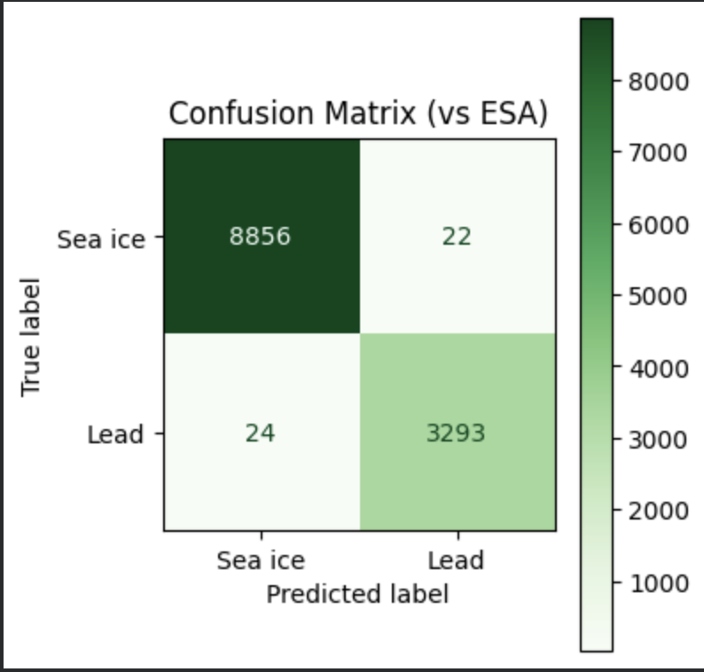

## Week-4-assignment
sea-ice and lead unsupervised learning

## Task 
- **Unsupervised classification** of Sentinel-3 altimetry echoes into **sea ice** and **leads**
- Compute **mean echo shape** and **standard deviation** for both classes
- Compare predicted labels with **ESA official labels** using a **confusion matrix**

---

## Data and labels
Sentinel-3 altimetry products contain radar **echo waveforms** (the returned signal after transmitting a pulse).  
Different surface types (sea ice vs open water leads) tend to produce different waveform shapes and strengths.

- Echo waveforms are extracted from the Sentinel-3 product (NetCDF within the `.SEN3` structure).
- The **ESA official surface-type label** (flag) is used as the reference (“ground truth”) for evaluation.
- Only the **sea ice** and **lead** samples are used for the final binary comparison.

---

## Method overview
## 1) Feature preparation
The notebook prepares echo-based variables and removes invalid values (e.g., NaNs).  
These features are then used as the input for clustering.

## 2) Unsupervised clustering (GMM)
A **Gaussian Mixture Model (GMM)** with **two components** is fitted to the prepared data:
- Cluster A
- Cluster B

Because GMM cluster IDs (0/1) are arbitrary, cluster labels are **aligned** to the ESA classes before evaluation.

## 3) Echo statistics (required outputs)
For the predicted **sea-ice** and **lead** classes:
- Mean echo shape is computed across all echoes in that class
- Standard deviation is computed to show within-class variability  
These are plotted together as **mean ± 1 standard deviation**.

## 4) Evaluation vs ESA
The predicted class labels are compared against ESA official labels using:
- Confusion matrix
- (Optional in notebook) classification report / accuracy

---

## Files 
- `Assignment_4.ipynb` — main notebook (full workflow)
- `mean_echoshape_wihin1std.png` — mean echo shape ± 1 std for sea ice and lead 
- `GMM.png` — confusion matrix comparing GMM classification vs ESA labels 
- `Alignment.png` — waveform alignment comparison (helps interpret mean/std)
- `lead_cluster_waves_cleaned.png` — example waveforms classified as lead
- `seaice_cluster_waves_cleaned.png` — example waveforms classified as sea ice

---

## Results (key figures)
### Mean echo shape (± 1 std)
This figure shows the average waveform shape for each class and its variability.

### Confusion matrix (GMM vs ESA)
This matrix compares my aligned GMM classification with ESA official labels.

---
